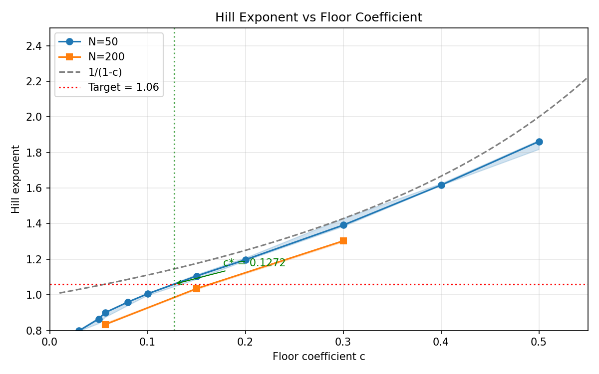

# Floor Calibration Results

## Configuration

- M = 20, T = 8000, burn_in = 3000
- 5 reps per scenario
- market_size_fixed = True, α = 0 (no pooling)
- log_family = 'laplace', IQR ∈ [0.1, 0.3]
- metric_every = 100

## Calibration Result

**c_star = 0.127170**

Hill exponent at c_star = 1.0600 (target = 1.06)

## N=50 Results

| c | 1/(1-c) | Hill [25,75] | HHI [25,75] | Top10 | Floor frac |
|---|---------|--------------|-------------|-------|------------|
| 0.0300 | 1.0309 | 0.7982 [0.7970, 0.8036] | 0.2633 [0.2610, 0.2656] | 0.8271 | 0.0872 |
| 0.0500 | 1.0526 | 0.8646 [0.8394, 0.8716] | 0.2223 [0.2141, 0.2340] | 0.7865 | 0.0923 |
| 0.0566 | 1.0600 | 0.8998 [0.8745, 0.9034] | 0.2155 [0.2086, 0.2202] | 0.7700 | 0.0905 |
| 0.0800 | 1.0870 | 0.9596 [0.9416, 0.9618] | 0.1834 [0.1740, 0.1839] | 0.7250 | 0.0994 |
| 0.1000 | 1.1111 | 1.0057 [0.9976, 1.0090] | 0.1552 [0.1537, 0.1556] | 0.6899 | 0.1028 |
| 0.1500 | 1.1765 | 1.1057 [1.0882, 1.1139] | 0.1194 [0.1191, 0.1289] | 0.6279 | 0.1253 |
| 0.2000 | 1.2500 | 1.1972 [1.1923, 1.2082] | 0.0969 [0.0963, 0.0994] | 0.5684 | 0.1294 |
| 0.3000 | 1.4286 | 1.3917 [1.3848, 1.4293] | 0.0674 [0.0667, 0.0675] | 0.4835 | 0.1675 |
| 0.4000 | 1.6667 | 1.6163 [1.6160, 1.6257] | 0.0488 [0.0474, 0.0498] | 0.4043 | 0.1930 |
| 0.5000 | 2.0000 | 1.8617 [1.8184, 1.8690] | 0.0373 [0.0371, 0.0385] | 0.3397 | 0.2366 |

## N=200 Results (finite-N correction check)

| c | 1/(1-c) | Hill [25,75] | HHI [25,75] | Top10 | Floor frac |
|---|---------|--------------|-------------|-------|------------|
| 0.0566 | 1.0600 | 0.8329 [0.8320, 0.8415] | 0.1378 [0.1353, 0.1415] | 0.8215 | 0.1149 |
| 0.1500 | 1.1765 | 1.0349 [1.0304, 1.0352] | 0.0632 [0.0624, 0.0645] | 0.6769 | 0.1388 |
| 0.3000 | 1.4286 | 1.3031 [1.2978, 1.3071] | 0.0290 [0.0284, 0.0290] | 0.5150 | 0.1764 |

## Floor Share vs Floor Size

The theoretical formula Hill = 1/(1-c) assumes the floor is at **share c**. However, the
model sets the floor at **absolute size c × market_mean_size**. With `market_size_fixed=True`,
the floor is at size c, which corresponds to floor share = c/N.

| N | c | Floor Size | Floor Share |
|---|---|------------|-------------|
| 50 | 0.0566 | 0.0566 | 0.113% |
| 200 | 0.0566 | 0.0566 | 0.028% |
| 200 | 0.3000 | 0.3000 | 0.150% |

This explains why Hill decreases with N for fixed c: the floor share shrinks, giving the
floor less "bite" on the tail distribution. At N=200 with c=0.0566, the floor share is
only 0.03%, so the distribution is essentially unbounded and Hill approaches ~1.

For meaningful asymptotic comparison, use higher c values (e.g., c=0.3) where the floor
share remains significant even at large N.

## Figure

The figure shows Hill exponent vs floor coefficient c for N=50 and N=200,
with the theoretical 1/(1-c) curve for comparison.
