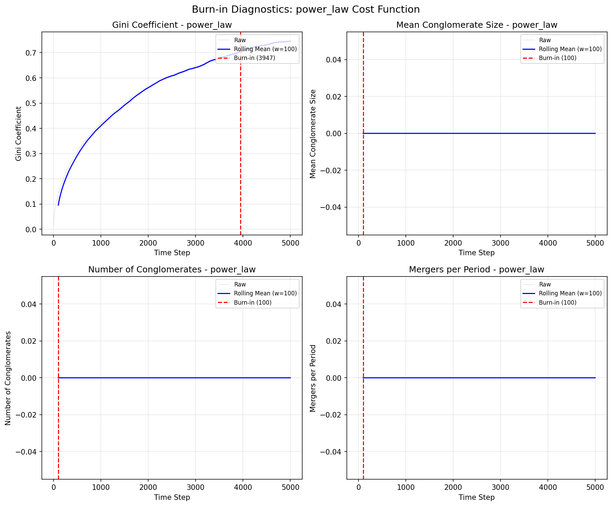
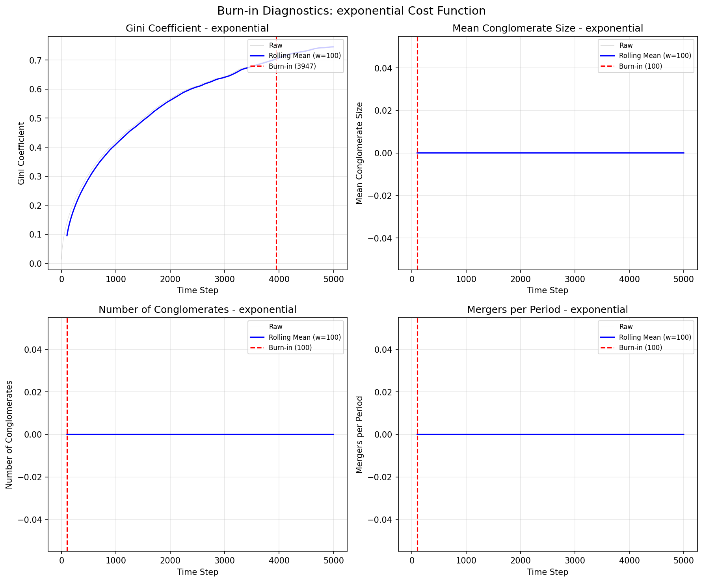
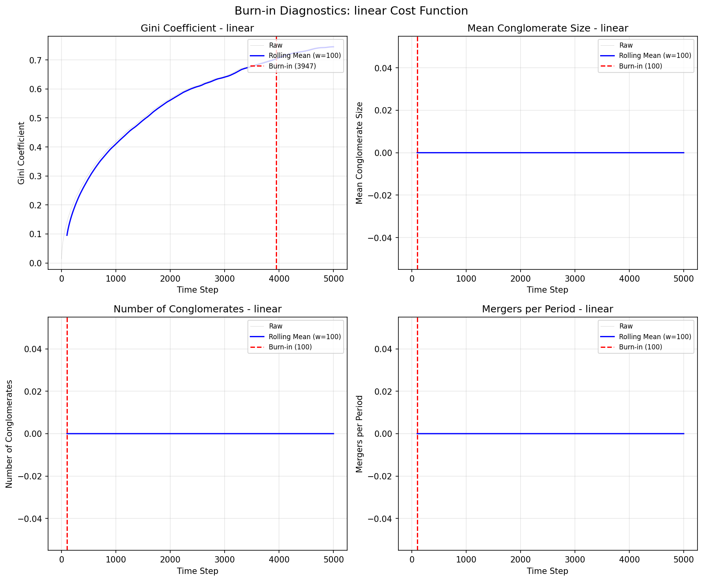
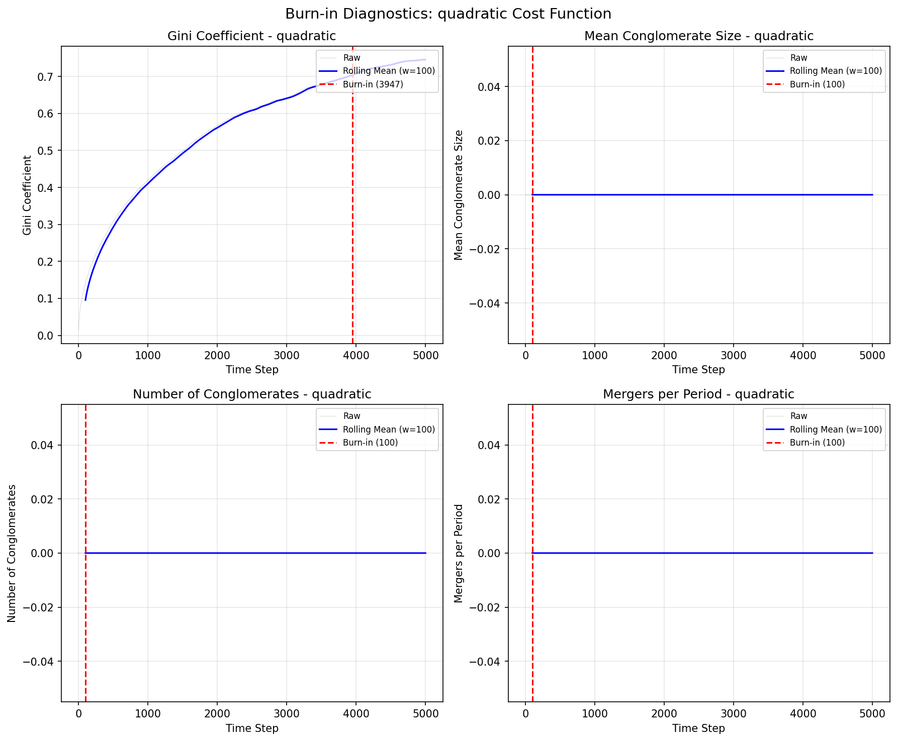

# Burn-in Diagnostics

Analysis of simulation convergence for each cost function type.

## Rolling Mean Criterion

The rolling mean with window size 100 is used to assess stationarity.
Convergence is determined by:
- Coefficient of variation in late portion < 1%
- Relative drift between early and late means < 1%

## Summary Table

| Cost Type | Metric | Early Mean | Late Mean | CV (Late) | Drift | Converged | Burn-in |
|-----------|--------|------------|-----------|-----------|-------|-----------|---------|
| power_law | Gini | 0.3316 | 0.7251 | 0.0215 | 0.5427 | ✗ | 3947 |
| power_law | Mean Size | 0.0000 | 0.0000 | 0.0000 | 0.0000 | ✓ | 100 |
| power_law | Num Cong | 0.0000 | 0.0000 | 0.0000 | 0.0000 | ✓ | 100 |
| power_law | Mergers | 0.0000 | 0.0000 | 0.0000 | 0.0000 | ✓ | 100 |
| exponential | Gini | 0.3316 | 0.7251 | 0.0215 | 0.5427 | ✗ | 3947 |
| exponential | Mean Size | 0.0000 | 0.0000 | 0.0000 | 0.0000 | ✓ | 100 |
| exponential | Num Cong | 0.0000 | 0.0000 | 0.0000 | 0.0000 | ✓ | 100 |
| exponential | Mergers | 0.0000 | 0.0000 | 0.0000 | 0.0000 | ✓ | 100 |
| linear | Gini | 0.3316 | 0.7251 | 0.0215 | 0.5427 | ✗ | 3947 |
| linear | Mean Size | 0.0000 | 0.0000 | 0.0000 | 0.0000 | ✓ | 100 |
| linear | Num Cong | 0.0000 | 0.0000 | 0.0000 | 0.0000 | ✓ | 100 |
| linear | Mergers | 0.0000 | 0.0000 | 0.0000 | 0.0000 | ✓ | 100 |
| quadratic | Gini | 0.3316 | 0.7251 | 0.0215 | 0.5427 | ✗ | 3947 |
| quadratic | Mean Size | 0.0000 | 0.0000 | 0.0000 | 0.0000 | ✓ | 100 |
| quadratic | Num Cong | 0.0000 | 0.0000 | 0.0000 | 0.0000 | ✓ | 100 |
| quadratic | Mergers | 0.0000 | 0.0000 | 0.0000 | 0.0000 | ✓ | 100 |

## Figures by Cost Type

### Power Law

### Exponential

### Linear

### Quadratic

## Conclusion

Based on the rolling mean analysis:

- Some metrics show incomplete convergence
- Consider increasing simulation length or adjusting parameters