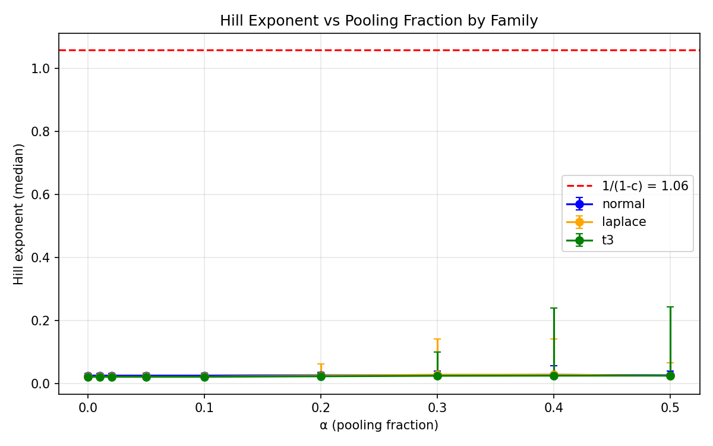
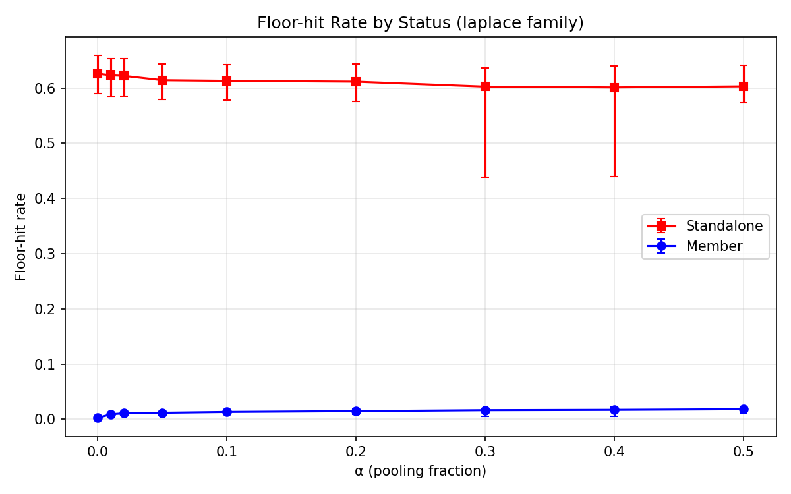
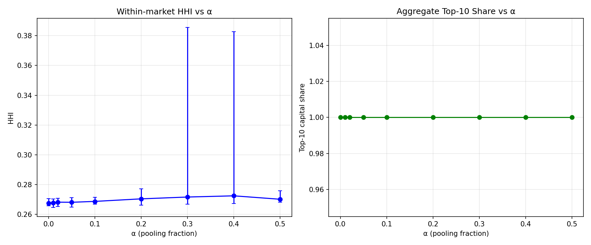

# Phase C Pilot Summary

## Overview

- **Scenarios**: 1275
- **Total runtime**: 41430s (11.51 CPU-hours)
- **Mean ms/step**: 5.42 ± 2.67
- **Grid**: 50 × 50 (M × N)

### Block counts

| Block | Count |
|-------|-------|
| correlation | 45 |
| cost-level | 360 |
| endogenous-alpha | 60 |
| equal-split | 180 |
| lookback | 90 |
| main | 540 |

## K versus K* by Family and Cost

Source: `pilot_c/tidy.csv` columns `K_post_burnin_median`, `K_eff_post_burnin_median`
Reference: `analytics/benchmarks.csv` column `K_star`

### At α = 0.1

| Family | Cost | K median [25,75] | K* | K_eff median [25,75] |
|--------|------|-----------------|-----|---------------------|
| laplace | exponential | 2.000 [2.000, 2.000] | 15 | 1.000 [1.000, 1.000] |
| laplace | linear | 2.000 [2.000, 2.000] | 10 | 1.000 [1.000, 1.000] |
| laplace | power_law | 2.000 [2.000, 2.000] | 10 | 1.000 [1.000, 1.000] |
| laplace | quadratic | 2.000 [2.000, 2.000] | 12 | 1.000 [1.000, 1.000] |
| normal | exponential | 2.000 [2.000, 2.000] | 12 | 1.177 [1.000, 1.395] |
| normal | linear | 2.000 [2.000, 2.000] | 7 | 1.000 [1.000, 1.000] |
| normal | power_law | 2.000 [2.000, 2.000] | 8 | 1.000 [1.000, 1.000] |
| normal | quadratic | 2.000 [2.000, 2.000] | 10 | 1.025 [1.000, 1.052] |
| t3 | exponential | 2.000 [2.000, 2.000] | 47 | 1.000 [1.000, 1.000] |
| t3 | linear | 2.000 [2.000, 2.000] | 28 | 1.000 [1.000, 1.000] |
| t3 | power_law | 2.000 [2.000, 2.000] | 20 | 1.000 [1.000, 1.000] |
| t3 | quadratic | 2.000 [2.000, 2.000] | 24 | 1.000 [1.000, 1.000] |

## Hill Exponent

Source: `pilot_c/tidy.csv` column `hill_exponent_median`

**Theoretical at α=0**: 1/(1−c) = 1/(1−0.0566) = 1.0600

### At α = 0

| Family | Hill median [25,75] |
|--------|---------------------|
| laplace | 0.022 [0.019, 0.029] |
| normal | 0.025 [0.023, 0.031] |
| t3 | 0.021 [0.019, 0.026] |

### Hill exponent versus α (laplace family)

| α | Hill median [25,75] |
|---|---------------------|
| 0.0 | 0.022 [0.019, 0.029] |
| 0.01 | 0.022 [0.019, 0.029] |
| 0.02 | 0.022 [0.019, 0.029] |
| 0.05 | 0.022 [0.019, 0.034] |
| 0.1 | 0.022 [0.019, 0.034] |
| 0.2 | 0.025 [0.021, 0.063] |
| 0.3 | 0.028 [0.021, 0.141] |
| 0.4 | 0.028 [0.021, 0.141] |
| 0.5 | 0.025 [0.020, 0.066] |

## Floor-hit Rate by Status

Source: `pilot_c/tidy.csv` columns `floor_hit_rate_standalone`, `floor_hit_rate_member`

### Laplace family

| α | Standalone [25,75] | Member [25,75] |
|---|-------------------|----------------|
| 0.0 | 0.626 [0.590, 0.660] | 0.003 [0.002, 0.004] |
| 0.01 | 0.623 [0.584, 0.653] | 0.009 [0.004, 0.011] |
| 0.02 | 0.622 [0.585, 0.653] | 0.011 [0.007, 0.012] |
| 0.05 | 0.614 [0.580, 0.644] | 0.012 [0.008, 0.013] |
| 0.1 | 0.613 [0.578, 0.643] | 0.013 [0.010, 0.016] |
| 0.2 | 0.611 [0.576, 0.643] | 0.015 [0.009, 0.018] |
| 0.3 | 0.602 [0.438, 0.636] | 0.016 [0.006, 0.019] |
| 0.4 | 0.601 [0.439, 0.640] | 0.017 [0.006, 0.022] |
| 0.5 | 0.603 [0.573, 0.641] | 0.018 [0.011, 0.024] |

## HHI and Top-10 Share

Source: `pilot_c/tidy.csv` columns `hhi_within_median`, `hhi_aggregate_median`, `top10_aggregate_median`

### Laplace family

| α | HHI within [25,75] | HHI agg [25,75] | Top-10 [25,75] |
|---|-------------------|-----------------|----------------|
| 0.0 | 0.267 [0.266, 0.270] | 0.212 [0.190, 0.221] | 1.000 [1.000, 1.000] |
| 0.01 | 0.268 [0.265, 0.270] | 0.211 [0.191, 0.221] | 1.000 [1.000, 1.000] |
| 0.02 | 0.268 [0.265, 0.271] | 0.210 [0.190, 0.221] | 1.000 [1.000, 1.000] |
| 0.05 | 0.268 [0.265, 0.271] | 0.211 [0.190, 0.225] | 1.000 [1.000, 1.000] |
| 0.1 | 0.269 [0.267, 0.271] | 0.211 [0.190, 0.225] | 1.000 [1.000, 1.000] |
| 0.2 | 0.270 [0.266, 0.277] | 0.214 [0.194, 0.245] | 1.000 [1.000, 1.000] |
| 0.3 | 0.272 [0.267, 0.386] | 0.218 [0.194, 0.373] | 1.000 [1.000, 1.000] |
| 0.4 | 0.272 [0.267, 0.383] | 0.218 [0.194, 0.368] | 1.000 [1.000, 1.000] |
| 0.5 | 0.270 [0.268, 0.276] | 0.214 [0.194, 0.245] | 1.000 [1.000, 1.000] |

## Equal-split Check

Comparison of equal-split block to main normal block.
Source: `pilot_c/tidy.csv` column `K_post_burnin_median`, filtered by `block` and `sharing_rule`

### At α = 0.1

| Cost | K (proportional) [25,75] | K (equal) [25,75] |
|------|--------------------------|-------------------|
| exponential | 2.000 [2.000, 2.000] | 2.000 [2.000, 2.000] |
| linear | 2.000 [2.000, 2.000] | 2.000 [2.000, 2.000] |
| power_law | 2.000 [2.000, 2.000] | 2.000 [2.000, 2.000] |
| quadratic | 2.000 [2.000, 2.000] | 2.000 [2.000, 2.000] |

## Lookback Sensitivity

Comparison of lookback block (200, 1000) to main laplace/power_law cell (50).
Source: `pilot_c/tidy.csv` columns `K_post_burnin_median`, `hill_exponent_median`, filtered by `block` and `lookback`

### At α = 0.1

| Lookback | K [25,75] | Hill [25,75] |
|----------|-----------|--------------|
| 50 (ref) | 2.000 [2.000, 2.000] | 0.032 [0.022, 0.040] |
| 200 | 4.000 [4.000, 4.000] | 0.275 [0.269, 0.276] |
| 1000 | 7.000 [6.000, 7.000] | 0.246 [0.244, 0.249] |

## Correlation Sensitivity

Comparison of correlation block (cross_corr=0.3) to main laplace/power_law cell (cross_corr=0).
Source: `pilot_c/tidy.csv` columns `K_post_burnin_median`, `hill_exponent_median`, filtered by `block` and `cross_corr`

### At α = 0.1

| Cross-corr | K [25,75] | Hill [25,75] |
|------------|-----------|--------------|
| 0.0 (ref) | 2.000 [2.000, 2.000] | 0.032 [0.022, 0.040] |
| 0.3 | 2.000 [2.000, 2.000] | 0.017 [0.014, 0.027] |

## Endogenous α

Analysis of endogenous-alpha block.
Source: `pilot_c/tidy.csv` columns `alpha_adopted_median`, `alpha_adopted_mean`, `alpha_adopted_std`

### Adopted α by family and cost

| Family | Cost | α adopted (median) | α adopted (mean) | K |
|--------|------|--------------------|------------------|---|
| laplace | exponential | 0.450 | 0.476 | 2.0 |
| laplace | linear | 0.400 | 0.412 | 2.0 |
| laplace | power_law | 0.400 | 0.414 | 2.0 |
| laplace | quadratic | 0.400 | 0.427 | 2.0 |
| normal | exponential | 0.100 | 0.149 | 2.0 |
| normal | linear | 0.200 | 0.306 | 2.0 |
| normal | power_law | 0.250 | 0.325 | 2.0 |
| normal | quadratic | 0.200 | 0.309 | 2.0 |
| t3 | exponential | 0.450 | 0.485 | 2.0 |
| t3 | linear | 0.450 | 0.426 | 2.0 |
| t3 | power_law | 0.450 | 0.463 | 2.0 |
| t3 | quadratic | 0.450 | 0.450 | 2.0 |

## Figures

- `figures/pilot_c_hill_vs_alpha.png`: Hill exponent versus α by family
- `figures/pilot_c_k_vs_alpha.png`: K versus α by family (power_law cost)
- `figures/pilot_c_floor_hit.png`: Floor-hit rate by status (laplace family)
- `figures/pilot_c_hhi.png`: HHI and top-10 share versus α (laplace family)
