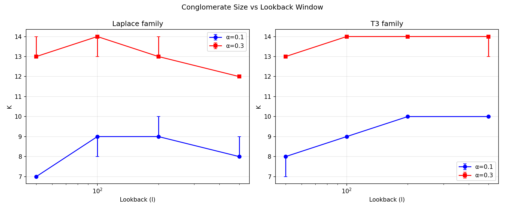
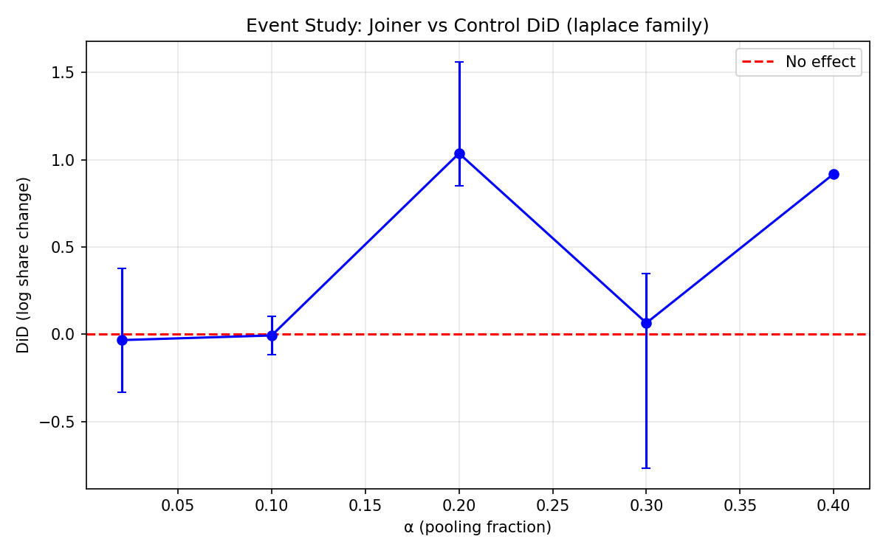
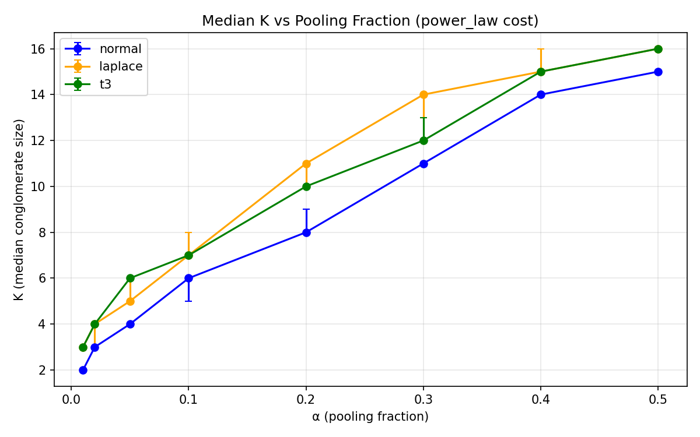
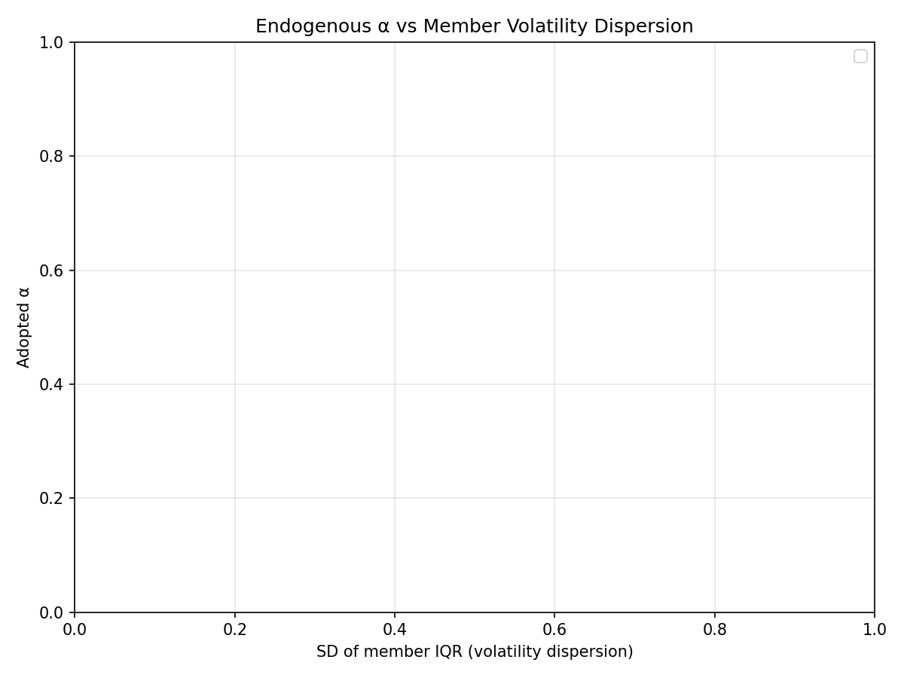

# Phase C Pilot Summary

## Overview

- **Scenarios**: 1400
- **Total runtime**: 239090s (66.41 CPU-hours)
- **Mean ms/step**: 15.53 ± 3.97
- **Grid**: 50 × 50 (M × N)

### Block counts

| Block | Count |
|-------|-------|
| correlation | 45 |
| cost-level | 360 |
| endogenous-alpha | 60 |
| equal-split | 180 |
| floor-level | 90 |
| lookback | 80 |
| main | 540 |
| rule-replay | 45 |

## K versus K* by Family and Cost

Source: `pilot_c/tidy.csv` columns `K_post_burnin_median`, `K_eff_post_burnin_median`
Reference: `analytics/benchmarks.csv` column `K_star`

### At α = 0.1

| Family | Cost | K [25,75] | K* | K_eff [25,75] | Acc. rate |
|--------|------|-----------|-----|---------------|-----------|
| laplace | exponential | 7.000 [7.000, 7.000] | — | 3.573 [3.564, 3.646] | 0.047 |
| laplace | linear | 6.000 [6.000, 7.000] | — | 3.404 [3.395, 3.580] | 0.027 |
| laplace | power_law | 7.000 [7.000, 8.000] | — | 3.569 [3.494, 3.581] | 0.025 |
| laplace | quadratic | 9.000 [9.000, 9.000] | — | 3.971 [3.916, 4.023] | 0.029 |
| normal | exponential | 5.000 [4.000, 5.000] | — | 3.003 [2.997, 3.265] | 0.052 |
| normal | linear | 5.000 [4.000, 5.000] | — | 2.981 [2.950, 2.994] | 0.039 |
| normal | power_law | 6.000 [5.000, 6.000] | — | 3.229 [3.216, 3.322] | 0.032 |
| normal | quadratic | 8.000 [8.000, 8.000] | — | 3.958 [3.875, 4.004] | 0.034 |
| t3 | exponential | 7.000 [7.000, 7.000] | — | 3.494 [3.448, 3.537] | 0.046 |
| t3 | linear | 8.000 [6.000, 8.000] | — | 3.483 [3.261, 3.542] | 0.025 |
| t3 | power_law | 7.000 [7.000, 7.000] | — | 3.470 [3.454, 3.488] | 0.025 |
| t3 | quadratic | 10.000 [9.000, 10.000] | — | 3.842 [3.803, 3.844] | 0.026 |

## Hill Exponent

Source: `pilot_c/tidy.csv` column `hill_exponent_median`

**Theoretical at α=0**: 1/(1−c) = 1/(1−0.1272) = 1.1457

### At α = 0

| Family | Hill median [25,75] |
|--------|---------------------|
| laplace | 1.064 [1.055, 1.073] |
| normal | 1.079 [1.071, 1.090] |
| t3 | 0.995 [0.986, 0.999] |

### Hill exponent versus α (laplace family)

| α | Hill median [25,75] |
|---|---------------------|
| 0.0 | 1.064 [1.055, 1.073] |
| 0.01 | 1.059 [1.051, 1.072] |
| 0.02 | 1.061 [1.053, 1.070] |
| 0.05 | 1.061 [1.055, 1.074] |
| 0.1 | 1.072 [1.058, 1.083] |
| 0.2 | 1.113 [1.103, 1.122] |
| 0.3 | 1.149 [1.142, 1.169] |
| 0.4 | 1.224 [1.208, 1.229] |
| 0.5 | 1.279 [1.267, 1.291] |

## Floor-hit Rate by Status

Source: `pilot_c/tidy.csv` columns `floor_hit_rate_standalone`, `floor_hit_rate_member`

### Laplace family

| α | Standalone [25,75] | Member [25,75] |
|---|-------------------|----------------|
| 0.0 | 0.115 [0.109, 0.121] | 0.000 [0.000, 0.000] |
| 0.01 | 0.027 [0.019, 0.052] | 0.084 [0.054, 0.094] |
| 0.02 | 0.011 [0.009, 0.037] | 0.098 [0.070, 0.107] |
| 0.05 | 0.005 [0.004, 0.014] | 0.100 [0.092, 0.107] |
| 0.1 | 0.003 [0.003, 0.006] | 0.097 [0.092, 0.104] |
| 0.2 | 0.002 [0.002, 0.003] | 0.087 [0.083, 0.093] |
| 0.3 | 0.001 [0.001, 0.002] | 0.076 [0.072, 0.080] |
| 0.4 | 0.001 [0.001, 0.001] | 0.064 [0.060, 0.068] |
| 0.5 | 0.000 [0.000, 0.000] | 0.052 [0.049, 0.055] |

## HHI and Top-10 Share

Source: `pilot_c/tidy.csv` columns `hhi_within_median`, `hhi_aggregate_median`, `top10pct_aggregate_median`

### Laplace family

| α | HHI within [25,75] | HHI agg [25,75] | Top-10 [25,75] | Cong. share [25,75] |
|---|-------------------|-----------------|----------------|---------------------|
| 0.0 | 0.181 [0.179, 0.184] | 0.004 [0.004, 0.004] | 0.656 [0.654, 0.661] | 0.000 [0.000, 0.000] |
| 0.01 | 0.181 [0.179, 0.184] | 0.004 [0.004, 0.004] | 0.574 [0.554, 0.610] | 0.340 [0.219, 0.405] |
| 0.02 | 0.181 [0.180, 0.184] | 0.004 [0.004, 0.004] | 0.521 [0.495, 0.571] | 0.479 [0.325, 0.515] |
| 0.05 | 0.181 [0.180, 0.184] | 0.005 [0.004, 0.005] | 0.460 [0.434, 0.505] | 0.615 [0.499, 0.644] |
| 0.1 | 0.179 [0.176, 0.181] | 0.005 [0.005, 0.006] | 0.417 [0.399, 0.449] | 0.690 [0.613, 0.729] |
| 0.2 | 0.169 [0.165, 0.171] | 0.007 [0.006, 0.007] | 0.381 [0.370, 0.399] | 0.774 [0.741, 0.816] |
| 0.3 | 0.155 [0.151, 0.157] | 0.009 [0.008, 0.009] | 0.353 [0.343, 0.365] | 0.875 [0.836, 0.897] |
| 0.4 | 0.140 [0.137, 0.142] | 0.010 [0.010, 0.011] | 0.319 [0.314, 0.327] | 0.958 [0.929, 0.973] |
| 0.5 | 0.125 [0.122, 0.127] | 0.011 [0.011, 0.012] | 0.302 [0.292, 0.304] | 0.991 [0.984, 0.996] |

## Equal-split Check

Comparison of equal-split block to main normal block.
Source: `pilot_c/tidy.csv` column `K_post_burnin_median`, filtered by `block` and `sharing_rule`

### At α = 0.1

| Cost | K (proportional) [25,75] | K (equal) [25,75] |
|------|--------------------------|-------------------|
| exponential | 5.000 [4.000, 5.000] | 2.000 [2.000, 2.000] |
| linear | 5.000 [4.000, 5.000] | 3.000 [3.000, 3.000] |
| power_law | 6.000 [5.000, 6.000] | 3.000 [3.000, 3.000] |
| quadratic | 8.000 [8.000, 8.000] | 3.000 [3.000, 3.000] |

## Lookback Sensitivity

Comparison of lookback block to main power_law cell by family (l ∈ {50, 100, 200, 500}).
Source: `pilot_c/tidy.csv` columns `K_post_burnin_median`, `hill_exponent_median`, filtered by `block` and `lookback`

### Laplace family at α = 0.3

| Lookback | K [25,75] | Hill [25,75] |
|----------|-----------|--------------|
| 50 | 13.000 [13.000, 14.000] | 1.154 [1.147, 1.159] |
| 100 | 14.000 [13.000, 14.000] | 1.165 [1.162, 1.183] |
| 200 | 13.000 [13.000, 14.000] | 1.153 [1.143, 1.168] |
| 500 | 12.000 [12.000, 12.000] | 1.175 [1.170, 1.177] |

### T3 family at α = 0.3

| Lookback | K [25,75] | Hill [25,75] |
|----------|-----------|--------------|
| 50 | 13.000 [13.000, 13.000] | 1.082 [1.080, 1.083] |
| 100 | 14.000 [14.000, 14.000] | 1.113 [1.093, 1.117] |
| 200 | 14.000 [14.000, 14.000] | 1.110 [1.105, 1.128] |
| 500 | 14.000 [13.000, 14.000] | 1.081 [1.075, 1.100] |

## Correlation Sensitivity

Comparison of correlation block (cross_corr=0.3) to main laplace/power_law cell (cross_corr=0).
Source: `pilot_c/tidy.csv` columns `K_post_burnin_median`, `hill_exponent_median`, filtered by `block` and `cross_corr`

### At α = 0.1

| Cross-corr | K [25,75] | Hill [25,75] |
|------------|-----------|--------------|
| 0.0 (ref) | 7.000 [7.000, 8.000] | 1.083 [1.078, 1.095] |
| 0.3 | 7.000 [7.000, 7.000] | 1.082 [1.080, 1.084] |

## Endogenous α

Analysis of endogenous-alpha block.
Source: `pilot_c/tidy.csv` columns `alpha_adopted_median`, `alpha_adopted_mean`, `alpha_adopted_std`

### Adopted α by family and cost

| Family | Cost | α adopted (median) | α adopted (mean) | K |
|--------|------|--------------------|------------------|---|
| laplace | exponential | 0.600 | 0.538 | 14.0 |
| laplace | linear | 0.550 | 0.509 | 9.0 |
| laplace | power_law | 0.500 | 0.482 | 10.0 |
| laplace | quadratic | 0.450 | 0.439 | 11.0 |
| normal | exponential | 0.700 | 0.682 | 14.0 |
| normal | linear | 0.600 | 0.528 | 7.0 |
| normal | power_law | 0.500 | 0.496 | 8.0 |
| normal | quadratic | 0.450 | 0.429 | 10.0 |
| t3 | exponential | 0.600 | 0.550 | 14.0 |
| t3 | linear | 0.600 | 0.531 | 9.0 |
| t3 | power_law | 0.600 | 0.519 | 10.0 |
| t3 | quadratic | 0.550 | 0.485 | 11.0 |

## Assortativity

SD of member IQR / SD of random K-subset. Ratio < 1 indicates positive assortment
(conglomerate members have more similar growth volatilities than random groups).

Source: `pilot_c/tidy.csv` column `assortativity_ratio`

### At α = 0.1 (power_law cost)

| Family | Assort. ratio [25,75] |
|--------|----------------------|
| laplace | — |
| normal | — |
| t3 | — |

## Event Study: Joiner Growth Gap

Matched difference-in-differences: log share change for joiners vs controls.
Controls matched by closest log share at entry, standalone throughout 2l window.
Source: `pilot_c/tidy.csv` column `event_did_median`

### Laplace family

| α | DiD median [25,75] | n events |
|---|-------------------|----------|
| 0.0 | — | — |
| 0.01 | — | — |
| 0.02 | -0.033 [-0.331, 0.379] | — |
| 0.05 | — | — |
| 0.1 | -0.006 [-0.118, 0.105] | — |
| 0.2 | 1.037 [0.851, 1.562] | — |
| 0.3 | 0.065 [-0.767, 0.350] | — |
| 0.4 | 0.920 [0.920, 0.920] | — |
| 0.5 | — | — |

## Acceptance by Proposal Type

Three acceptance rates: standalone↔standalone (s↔s), standalone↔conglomerate (s↔c),
conglomerate↔conglomerate (c↔c).
Source: `pilot_c/tidy.csv` columns `acc_rate_ss`, `acc_rate_sc`, `acc_rate_cc`

### Laplace family

| α | s↔s [25,75] | s↔c [25,75] | c↔c [25,75] |
|---|-------------|-------------|-------------|
| 0.0 | 0.000 [0.000, 0.000] | — | — |
| 0.01 | 0.167 [0.080, 0.261] | 0.061 [0.044, 0.067] | 0.007 [0.006, 0.012] |
| 0.02 | 0.270 [0.153, 0.362] | 0.069 [0.050, 0.074] | 0.007 [0.006, 0.011] |
| 0.05 | 0.407 [0.278, 0.479] | 0.061 [0.056, 0.068] | 0.004 [0.004, 0.012] |
| 0.1 | 0.476 [0.361, 0.531] | 0.049 [0.047, 0.055] | 0.004 [0.004, 0.007] |
| 0.2 | 0.535 [0.422, 0.567] | 0.035 [0.032, 0.039] | 0.005 [0.004, 0.007] |
| 0.3 | 0.577 [0.453, 0.620] | 0.025 [0.023, 0.027] | 0.005 [0.004, 0.009] |
| 0.4 | 0.626 [0.442, 0.689] | 0.020 [0.018, 0.021] | 0.004 [0.003, 0.005] |
| 0.5 | 0.500 [0.094, 0.579] | 0.016 [0.014, 0.018] | 0.004 [0.003, 0.005] |

## K Statistics (Median and Mean)

Source: `pilot_c/tidy.csv` columns `K_post_burnin_median`, `K_post_burnin_mean`

### Laplace family

| α | K median [25,75] |
|---|-----------------|
| 0.0 | — |
| 0.01 | 3.000 [2.000, 3.750] |
| 0.02 | 3.000 [2.750, 4.250] |
| 0.05 | 5.000 [4.750, 6.250] |
| 0.1 | 7.000 [6.750, 8.000] |
| 0.2 | 11.000 [10.000, 12.000] |
| 0.3 | 14.000 [13.750, 15.250] |
| 0.4 | 16.000 [15.000, 17.000] |
| 0.5 | 16.000 [16.000, 17.000] |

## Endogenous α Scatter

Scatter of adopted α vs SD of member IQR (volatility dispersion).
Spearman correlation tests whether conglomerates with more diverse members adopt higher α.

## Runtime Statistics

- **Total runtime**: 239090s (66.41 CPU-hours)
- **Mean ms/step**: 15.53 ± 3.97

## Figures

- `pilot_c_hill_vs_alpha.png`: Hill exponent versus α by family
- `pilot_c_k_vs_alpha.png`: K versus α by family (power_law cost)
- `pilot_c_floor_hit.png`: Floor-hit rate by status (laplace family)
- `pilot_c_hhi.png`: HHI and top-10 share versus α (laplace family)
- `pilot_c_ccs_vs_alpha.png`: Conglomerate capital share versus α
- `pilot_c_assortativity.png`: Assortativity ratio versus α
- `pilot_c_endo_alpha_hist.png`: Histogram of adopted α (endogenous block)
- `pilot_c_event_study.png`: Event study DiD versus α (laplace family)
- `pilot_c_alpha_scatter.png`: Adopted α versus SD of member IQR
- `pilot_c_lookback_k.png`: K versus lookback by family (laplace + t3)
