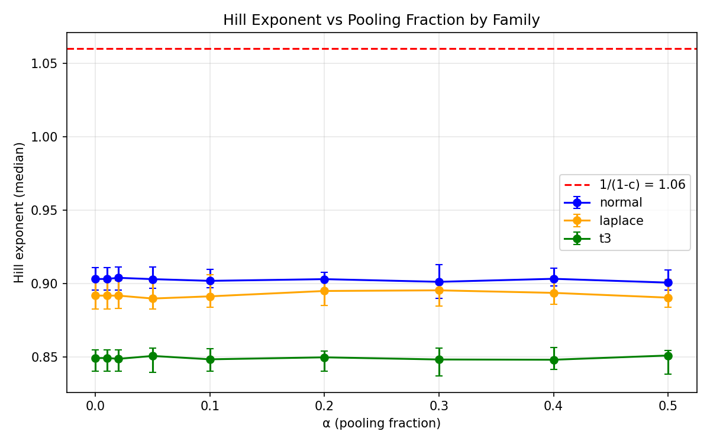
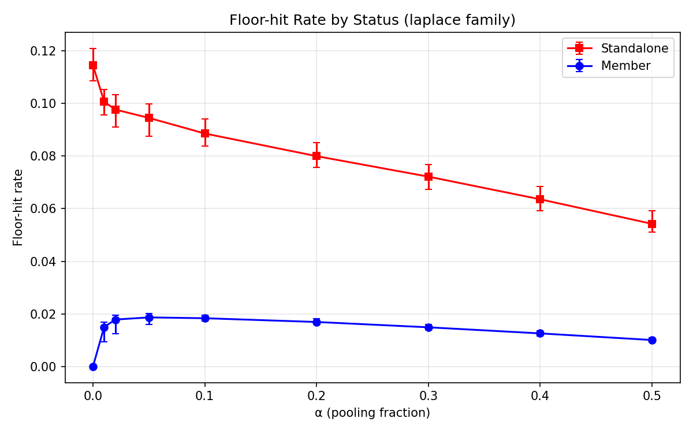
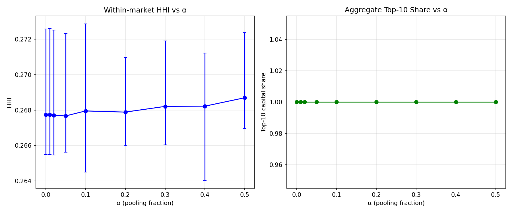
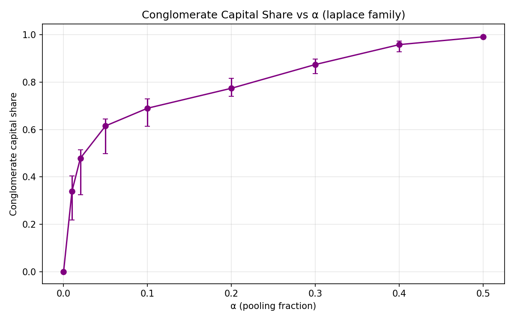
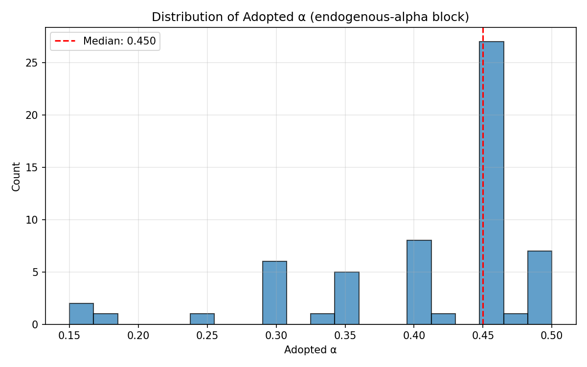
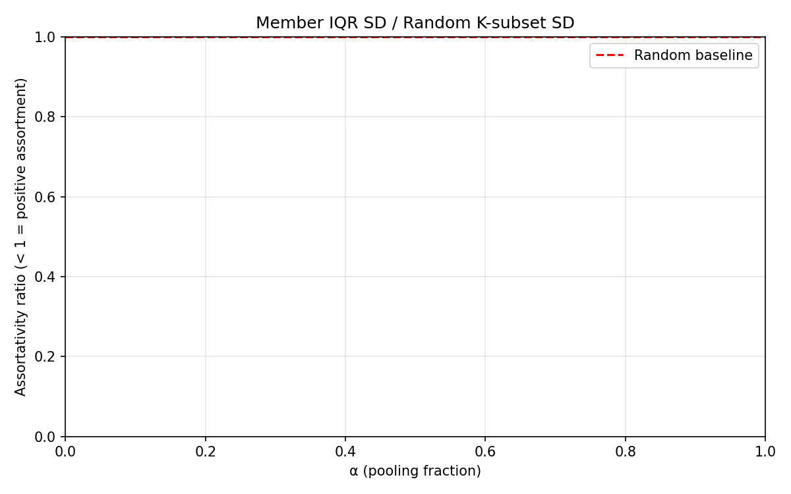

# Phase C Pilot Summary

## Overview

- **Scenarios**: 1540
- **Total runtime**: 305570s (84.88 CPU-hours)
- **Mean ms/step**: 18.04 ± 7.70
- **Grid**: 50 × 50 (M × N)

### Block counts

| Block | Count |
|-------|-------|
| correlation | 45 |
| cost-level | 360 |
| endogenous-alpha | 60 |
| equal-split | 180 |
| floor-level | 90 |
| lookback | 100 |
| main | 540 |
| rule-replay | 45 |
| search | 120 |

## K versus K* by Family and Cost

Source: `pilot_c/tidy.csv` columns `K_post_burnin_median`, `K_eff_post_burnin_median`
Reference: `analytics/benchmarks.csv` column `K_star`

### At α = 0.1

| Family | Cost | K [25,75] | K* | K_eff [25,75] | Acc. rate |
|--------|------|-----------|-----|---------------|-----------|
| laplace | exponential | 2.000 [2.000, 2.000] | 15 | 1.954 [1.953, 1.960] | 0.332 |
| laplace | linear | 3.000 [2.000, 3.000] | 10 | 1.960 [1.959, 1.964] | 0.402 |
| laplace | power_law | 3.000 [3.000, 3.000] | 10 | 1.964 [1.953, 1.970] | 0.413 |
| laplace | quadratic | 3.000 [3.000, 3.000] | 12 | 1.988 [1.985, 1.990] | 0.418 |
| normal | exponential | 2.000 [2.000, 2.000] | 12 | 1.949 [1.943, 1.957] | 0.182 |
| normal | linear | 3.000 [3.000, 3.000] | 7 | 1.988 [1.987, 1.988] | 0.303 |
| normal | power_law | 3.000 [3.000, 3.000] | 8 | 1.990 [1.990, 1.990] | 0.325 |
| normal | quadratic | 3.000 [3.000, 3.000] | 10 | 2.068 [2.050, 2.128] | 0.341 |
| t3 | exponential | 2.000 [2.000, 2.000] | 47 | 1.923 [1.922, 1.928] | 0.395 |
| t3 | linear | 2.000 [2.000, 2.000] | 28 | 1.919 [1.918, 1.926] | 0.479 |
| t3 | power_law | 2.000 [2.000, 2.000] | 20 | 1.934 [1.930, 1.937] | 0.452 |
| t3 | quadratic | 2.000 [2.000, 3.000] | 24 | 1.935 [1.935, 1.954] | 0.497 |

## Hill Exponent

Source: `pilot_c/tidy.csv` column `hill_exponent_median`

**Theoretical at α=0**: 1/(1−c) = 1/(1−0.1272) = 1.1457

### At α = 0

| Family | Hill median [25,75] |
|--------|---------------------|
| laplace | 1.064 [1.055, 1.073] |
| normal | 1.079 [1.071, 1.090] |
| t3 | 0.995 [0.986, 0.999] |

### Hill exponent versus α (laplace family)

| α | Hill median [25,75] |
|---|---------------------|
| 0.0 | 1.064 [1.055, 1.073] |
| 0.01 | 1.057 [1.054, 1.075] |
| 0.02 | 1.062 [1.054, 1.074] |
| 0.05 | 1.062 [1.060, 1.079] |
| 0.1 | 1.081 [1.071, 1.088] |
| 0.2 | 1.107 [1.097, 1.123] |
| 0.3 | 1.161 [1.148, 1.174] |
| 0.4 | 1.217 [1.208, 1.247] |
| 0.5 | 1.313 [1.298, 1.333] |

## Floor-hit Rate by Status

Source: `pilot_c/tidy.csv` columns `floor_hit_rate_standalone`, `floor_hit_rate_member`

### Laplace family

| α | Standalone [25,75] | Member [25,75] |
|---|-------------------|----------------|
| 0.0 | 0.115 [0.109, 0.121] | 0.000 [0.000, 0.000] |
| 0.01 | 0.101 [0.096, 0.105] | 0.015 [0.009, 0.017] |
| 0.02 | 0.098 [0.091, 0.103] | 0.018 [0.013, 0.019] |
| 0.05 | 0.094 [0.088, 0.100] | 0.019 [0.016, 0.020] |
| 0.1 | 0.089 [0.084, 0.094] | 0.018 [0.017, 0.020] |
| 0.2 | 0.080 [0.076, 0.085] | 0.017 [0.016, 0.018] |
| 0.3 | 0.072 [0.067, 0.077] | 0.015 [0.014, 0.016] |
| 0.4 | 0.064 [0.059, 0.068] | 0.013 [0.012, 0.014] |
| 0.5 | 0.054 [0.051, 0.059] | 0.010 [0.009, 0.011] |

## HHI and Top-10 Share

Source: `pilot_c/tidy.csv` columns `hhi_within_median`, `hhi_aggregate_median`, `top10pct_aggregate_median`

### Laplace family

| α | HHI within [25,75] | HHI agg [25,75] | Top-10 [25,75] | Cong. share [25,75] |
|---|-------------------|-----------------|----------------|---------------------|
| 0.0 | 0.181 [0.179, 0.184] | 0.004 [0.004, 0.004] | 0.656 [0.654, 0.661] | 0.000 [0.000, 0.000] |
| 0.01 | 0.181 [0.179, 0.184] | 0.004 [0.004, 0.004] | 0.651 [0.646, 0.654] | 0.232 [0.144, 0.294] |
| 0.02 | 0.180 [0.179, 0.184] | 0.004 [0.004, 0.004] | 0.654 [0.647, 0.658] | 0.362 [0.246, 0.421] |
| 0.05 | 0.179 [0.177, 0.182] | 0.004 [0.004, 0.004] | 0.660 [0.650, 0.666] | 0.508 [0.397, 0.543] |
| 0.1 | 0.177 [0.175, 0.179] | 0.004 [0.004, 0.005] | 0.664 [0.651, 0.673] | 0.594 [0.498, 0.611] |
| 0.2 | 0.167 [0.164, 0.170] | 0.005 [0.005, 0.005] | 0.672 [0.657, 0.682] | 0.679 [0.609, 0.703] |
| 0.3 | 0.154 [0.151, 0.156] | 0.005 [0.005, 0.006] | 0.687 [0.672, 0.696] | 0.765 [0.714, 0.780] |
| 0.4 | 0.138 [0.134, 0.140] | 0.006 [0.006, 0.007] | 0.705 [0.698, 0.715] | 0.838 [0.801, 0.859] |
| 0.5 | 0.121 [0.118, 0.123] | 0.008 [0.008, 0.008] | 0.727 [0.722, 0.740] | 0.902 [0.886, 0.910] |

## Equal-split Check

Comparison of equal-split block to main normal block.
Source: `pilot_c/tidy.csv` column `K_post_burnin_median`, filtered by `block` and `sharing_rule`

### At α = 0.1

| Cost | K (proportional) [25,75] | K (equal) [25,75] |
|------|--------------------------|-------------------|
| exponential | 2.000 [2.000, 2.000] | 2.000 [2.000, 2.000] |
| linear | 3.000 [3.000, 3.000] | 2.000 [2.000, 2.000] |
| power_law | 3.000 [3.000, 3.000] | 2.000 [2.000, 2.000] |
| quadratic | 3.000 [3.000, 3.000] | 2.000 [2.000, 2.000] |

## Lookback Sensitivity

Lookback block (l = 20, 50, 100, 200, 500) by family and α; reference row: main laplace/power_law cell (l = 50).
Source: `pilot_c/tidy.csv` columns `K_post_burnin_median`, `K_mean`, `cong_capital_share_median`, `floor_exits_per_period`, `hill_exponent_median`, filtered by `block` and `lookback`
Figure: `diagnostics/pilot_c_lookback_k.png`

### At α = 0.1

| Family | Lookback | K [25,75] | K_mean | CCS | Floor exits/period | Hill [25,75] |
|--------|----------|-----------|--------|-----|--------------------|--------------|
| laplace (main ref) | 50 | 3.000 [3.000, 3.000] | — | — | — | 1.098 [1.089, 1.100] |
| laplace | 20 | 2.000 [2.000, 2.000] | 2.660 | 0.428 | 44.42 | 1.075 [1.074, 1.083] |
| laplace | 50 | 3.000 [3.000, 3.000] | 3.005 | 0.636 | 45.92 | 1.085 [1.082, 1.088] |
| laplace | 100 | 3.000 [3.000, 3.000] | 3.194 | 0.756 | 47.50 | 1.098 [1.093, 1.098] |
| laplace | 200 | 3.000 [3.000, 3.000] | 3.453 | 0.825 | 44.46 | 1.086 [1.086, 1.093] |
| laplace | 500 | 4.000 [3.000, 4.000] | 3.921 | 0.881 | 49.81 | 1.087 [1.071, 1.098] |
| t3 | 20 | 2.000 [2.000, 2.000] | 2.562 | 0.430 | 54.26 | 1.009 [0.997, 1.010] |
| t3 | 50 | 2.000 [2.000, 2.000] | 2.873 | 0.631 | 50.74 | 1.021 [1.015, 1.026] |
| t3 | 100 | 3.000 [3.000, 3.000] | 3.085 | 0.741 | 50.53 | 1.033 [1.024, 1.047] |
| t3 | 200 | 3.000 [3.000, 3.000] | 3.268 | 0.814 | 55.45 | 1.020 [1.015, 1.024] |
| t3 | 500 | 3.000 [3.000, 3.000] | 3.748 | 0.852 | 57.88 | 1.023 [1.008, 1.038] |

### At α = 0.3

| Family | Lookback | K [25,75] | K_mean | CCS | Floor exits/period | Hill [25,75] |
|--------|----------|-----------|--------|-----|--------------------|--------------|
| laplace (main ref) | 50 | 3.000 [3.000, 3.000] | — | — | — | 1.165 [1.154, 1.174] |
| laplace | 20 | 3.000 [3.000, 3.000] | 3.286 | 0.600 | 36.77 | 1.119 [1.118, 1.124] |
| laplace | 50 | 3.000 [3.000, 3.000] | 4.038 | 0.785 | 36.00 | 1.171 [1.155, 1.177] |
| laplace | 100 | 4.000 [4.000, 4.000] | 4.419 | 0.863 | 36.94 | 1.175 [1.162, 1.179] |
| laplace | 200 | 4.000 [4.000, 4.000] | 4.821 | 0.909 | 34.47 | 1.198 [1.197, 1.203] |
| laplace | 500 | 5.000 [5.000, 5.000] | 5.361 | 0.917 | 38.38 | 1.184 [1.176, 1.186] |
| t3 | 20 | 2.000 [2.000, 2.000] | 3.005 | 0.589 | 46.86 | 1.041 [1.039, 1.053] |
| t3 | 50 | 3.000 [3.000, 3.000] | 3.682 | 0.775 | 41.98 | 1.093 [1.093, 1.100] |
| t3 | 100 | 3.000 [3.000, 3.000] | 4.067 | 0.856 | 41.09 | 1.094 [1.086, 1.104] |
| t3 | 200 | 4.000 [4.000, 4.000] | 4.282 | 0.889 | 45.66 | 1.087 [1.081, 1.090] |
| t3 | 500 | 4.000 [4.000, 4.000] | 4.920 | 0.893 | 47.04 | 1.107 [1.101, 1.108] |

## Search intensity

Search block (merge_thresh = 0.2, 1.0) and the main power_law cell (merge_thresh = 0.05), by family × α × merge_thresh; medians over reps.
Source: `pilot_c/tidy.csv`, blocks `search` and `main` (power_law). Figure: `diagnostics/pilot_c_search.png` (K* dashed).

| Family | α | merge_thresh | K_mean | K_post_burnin_median | CCS | Mergers/period | Floor exits/period | Hill |
|--------|---|--------------|--------|----------------------|-----|----------------|--------------------|------|
| normal | 0.05 | 0.05 | 2.705 | 2.0 | 0.473 | 39.54 | 36.03 | 1.081 |
| normal | 0.05 | 0.2 | 3.245 | 3.0 | 0.687 | 74.13 | 70.20 | 1.090 |
| normal | 0.05 | 1 | 3.696 | 4.0 | 0.807 | 130.49 | 126.42 | 1.089 |
| normal | 0.1 | 0.05 | 3.040 | 3.0 | 0.561 | 37.70 | 34.76 | 1.087 |
| normal | 0.1 | 0.2 | 3.843 | 4.0 | 0.745 | 68.90 | 66.10 | 1.100 |
| normal | 0.1 | 1 | 4.511 | 4.0 | 0.856 | 121.39 | 118.76 | 1.111 |
| normal | 0.3 | 0.05 | 4.288 | 4.0 | 0.733 | 27.32 | 26.03 | 1.169 |
| normal | 0.3 | 0.2 | 5.942 | 6.0 | 0.872 | 45.37 | 44.59 | 1.202 |
| normal | 0.3 | 1 | 7.152 | 7.0 | 0.925 | 83.27 | 82.69 | 1.182 |
| normal | 0.5 | 0.05 | 6.337 | 6.0 | 0.912 | 16.29 | 16.06 | 1.316 |
| normal | 0.5 | 0.2 | 9.010 | 9.0 | 0.966 | 25.04 | 24.99 | 1.331 |
| normal | 0.5 | 1 | 10.451 | 11.0 | 0.984 | 46.56 | 46.53 | 1.322 |
| laplace | 0.05 | 0.05 | 2.747 | 2.0 | 0.563 | 50.20 | 48.15 | 1.075 |
| laplace | 0.05 | 0.2 | 3.341 | 3.0 | 0.725 | 95.17 | 92.75 | 1.062 |
| laplace | 0.05 | 1 | 3.906 | 4.0 | 0.853 | 176.96 | 174.77 | 1.074 |
| laplace | 0.1 | 0.05 | 3.005 | 3.0 | 0.634 | 48.57 | 46.77 | 1.098 |
| laplace | 0.1 | 0.2 | 3.863 | 3.0 | 0.791 | 89.70 | 87.88 | 1.083 |
| laplace | 0.1 | 1 | 4.634 | 4.0 | 0.885 | 166.25 | 164.80 | 1.088 |
| laplace | 0.3 | 0.05 | 3.999 | 3.0 | 0.782 | 37.76 | 36.88 | 1.165 |
| laplace | 0.3 | 0.2 | 5.765 | 5.0 | 0.888 | 63.08 | 62.51 | 1.195 |
| laplace | 0.3 | 1 | 7.144 | 7.0 | 0.944 | 119.03 | 118.66 | 1.169 |
| laplace | 0.5 | 0.05 | 5.948 | 5.0 | 0.906 | 25.24 | 25.05 | 1.329 |
| laplace | 0.5 | 0.2 | 8.839 | 9.0 | 0.970 | 38.08 | 38.04 | 1.322 |
| laplace | 0.5 | 1 | 10.656 | 11.0 | 0.987 | 73.22 | 73.19 | 1.307 |
| t3 | 0.05 | 0.05 | 2.665 | 2.0 | 0.563 | 55.05 | 53.33 | 1.005 |
| t3 | 0.05 | 0.2 | 3.251 | 3.0 | 0.745 | 111.81 | 109.87 | 1.012 |
| t3 | 0.05 | 1 | 3.884 | 4.0 | 0.857 | 206.59 | 204.92 | 1.002 |
| t3 | 0.1 | 0.05 | 2.866 | 2.0 | 0.627 | 53.69 | 52.13 | 1.018 |
| t3 | 0.1 | 0.2 | 3.669 | 3.0 | 0.808 | 106.48 | 104.98 | 1.031 |
| t3 | 0.1 | 1 | 4.500 | 4.0 | 0.888 | 194.35 | 193.24 | 1.027 |
| t3 | 0.3 | 0.05 | 3.667 | 3.0 | 0.773 | 44.12 | 43.18 | 1.096 |
| t3 | 0.3 | 0.2 | 5.213 | 5.0 | 0.903 | 80.49 | 79.99 | 1.101 |
| t3 | 0.3 | 1 | 6.661 | 6.0 | 0.954 | 144.23 | 143.91 | 1.104 |
| t3 | 0.5 | 0.05 | 5.063 | 4.0 | 0.884 | 32.60 | 32.28 | 1.182 |
| t3 | 0.5 | 0.2 | 7.755 | 8.0 | 0.962 | 53.38 | 53.28 | 1.221 |
| t3 | 0.5 | 1 | 9.775 | 10.0 | 0.984 | 96.94 | 96.86 | 1.229 |

## Event study (ITT and owner path)

Conglomerate entry, main block power_law, 27 traced scenarios; mean over reps 0-2 of per-scenario medians. ITT = all matched entries on raw log share; owner = the same DiD on log share net of cumulative floor jumps (what owners earned, excluding recapitalisation).
Source: `pilot_c/event_study_summary.csv`

| Family | α | n_events | n_matched | share_floor_before | did_itt_median | did_owner_median | did_nofloor_median | did_owner_nofloor_median | did_small | did_owner_small | did_mid | did_owner_mid | did_large | did_owner_large |
|---|---|---|---|---|---|---|---|---|---|---|---|---|---|---|
| normal | 0.05 | 470901 | 243728 | 0.75352 | 0.00295 | 0.00085 | -0.00198 | -0.00235 | 0.00434 | 0.00061 | 0.00288 | 0.00123 | 0.00120 | 0.00071 |
| normal | 0.1 | 429736 | 208214 | 0.78225 | 0.00312 | 0.00151 | 0.00114 | 0.00103 | 0.00441 | 0.00095 | 0.00287 | 0.00140 | 0.00181 | 0.00211 |
| normal | 0.3 | 289978 | 138034 | 0.84619 | 0.00240 | 0.00195 | 0.00294 | 0.00331 | 0.00388 | 0.00063 | 0.00203 | 0.00170 | 0.00110 | 0.00354 |
| laplace | 0.05 | 563595 | 270911 | 0.83302 | 0.00384 | -0.00011 | -0.00185 | -0.00221 | 0.00495 | -0.00137 | 0.00376 | 0.00007 | 0.00261 | 0.00097 |
| laplace | 0.1 | 528041 | 244922 | 0.85079 | 0.00390 | 0.00065 | 0.00195 | 0.00174 | 0.00505 | -0.00080 | 0.00362 | 0.00021 | 0.00284 | 0.00250 |
| laplace | 0.3 | 390683 | 177493 | 0.89460 | 0.00341 | 0.00127 | 0.00495 | 0.00579 | 0.00472 | -0.00084 | 0.00297 | 0.00069 | 0.00242 | 0.00387 |
| t3 | 0.05 | 616212 | 306120 | 0.85482 | 0.00357 | -0.00075 | -0.00212 | -0.00289 | 0.00463 | -0.00184 | 0.00332 | -0.00080 | 0.00257 | 0.00042 |
| t3 | 0.1 | 585135 | 280712 | 0.86717 | 0.00368 | -0.00055 | 0.00160 | 0.00149 | 0.00474 | -0.00172 | 0.00337 | -0.00106 | 0.00283 | 0.00109 |
| t3 | 0.3 | 458074 | 216788 | 0.90298 | 0.00344 | -0.00037 | 0.00453 | 0.00571 | 0.00465 | -0.00212 | 0.00302 | -0.00126 | 0.00253 | 0.00211 |

**Means (heavy tails: the median of a 50-period window can hide rare large losses) and the joiner's owner path**

| Family | α | did_itt_mean | did_owner_mean | did_owner_trim_mean | joiner_before_owner | joiner_after_owner | joiner_before_owner_mean | joiner_after_owner_mean |
|---|---|---|---|---|---|---|---|---|
| normal | 0.05 | 0.00298 | 0.00074 | 0.00077 | -0.01709 | -0.00960 | -0.01824 | -0.01104 |
| normal | 0.1 | 0.00338 | 0.00134 | 0.00137 | -0.01778 | -0.00901 | -0.01892 | -0.01052 |
| normal | 0.3 | 0.00249 | 0.00180 | 0.00182 | -0.01836 | -0.00655 | -0.01946 | -0.00840 |
| laplace | 0.05 | 0.00420 | -0.00039 | -0.00036 | -0.02684 | -0.01766 | -0.02900 | -0.02012 |
| laplace | 0.1 | 0.00436 | 0.00028 | 0.00032 | -0.02739 | -0.01673 | -0.02964 | -0.01926 |
| laplace | 0.3 | 0.00365 | 0.00093 | 0.00098 | -0.02771 | -0.01287 | -0.02995 | -0.01579 |
| t3 | 0.05 | 0.00397 | -0.00144 | -0.00123 | -0.03079 | -0.02152 | -0.03545 | -0.02558 |
| t3 | 0.1 | 0.00425 | -0.00131 | -0.00109 | -0.03123 | -0.02047 | -0.03575 | -0.02444 |
| t3 | 0.3 | 0.00379 | -0.00149 | -0.00109 | -0.03105 | -0.01642 | -0.03552 | -0.02056 |

**Owner DiD by conglomerate size at entry (K = 2, 3–4, ≥ 5)**

| Family | α | n_K2 | n_K3_4 | n_K5p | did_owner_K2_median | did_owner_K2_mean | did_owner_K3_4_median | did_owner_K3_4_mean | did_owner_K5p_median | did_owner_K5p_mean |
|---|---|---|---|---|---|---|---|---|---|---|
| normal | 0.05 | 175155 | 60361 | 8212 | 0.00025 | 0.00004 | 0.00219 | 0.00211 | 0.00577 | 0.00548 |
| normal | 0.1 | 138638 | 52748 | 16829 | 0.00063 | 0.00043 | 0.00276 | 0.00239 | 0.00600 | 0.00550 |
| normal | 0.3 | 79139 | 28185 | 30710 | 0.00054 | 0.00028 | 0.00241 | 0.00207 | 0.00581 | 0.00545 |
| laplace | 0.05 | 193741 | 65367 | 11803 | -0.00087 | -0.00127 | 0.00146 | 0.00119 | 0.00549 | 0.00536 |
| laplace | 0.1 | 165451 | 59321 | 20150 | -0.00044 | -0.00089 | 0.00216 | 0.00172 | 0.00633 | 0.00560 |
| laplace | 0.3 | 105030 | 36301 | 36162 | -0.00051 | -0.00099 | 0.00202 | 0.00156 | 0.00671 | 0.00591 |
| t3 | 0.05 | 221734 | 71755 | 12631 | -0.00168 | -0.00234 | 0.00154 | 0.00054 | 0.00483 | 0.00320 |
| t3 | 0.1 | 193514 | 66422 | 20776 | -0.00165 | -0.00243 | 0.00141 | 0.00054 | 0.00496 | 0.00312 |
| t3 | 0.3 | 132850 | 46003 | 37935 | -0.00185 | -0.00281 | 0.00077 | -0.00056 | 0.00442 | 0.00205 |

## Correlation Sensitivity

Comparison of correlation block (cross_corr=0.3) to main laplace/power_law cell (cross_corr=0).
Source: `pilot_c/tidy.csv` columns `K_post_burnin_median`, `hill_exponent_median`, filtered by `block` and `cross_corr`

### At α = 0.1

| Cross-corr | K [25,75] | Hill [25,75] |
|------------|-----------|--------------|
| 0.0 (ref) | 3.000 [3.000, 3.000] | 1.098 [1.089, 1.100] |
| 0.3 | 3.000 [3.000, 3.000] | 1.091 [1.080, 1.097] |

## Endogenous α

Analysis of endogenous-alpha block.
Source: `pilot_c/tidy.csv` columns `alpha_adopted_median`, `alpha_adopted_mean`, `alpha_adopted_std`

### Adopted α by family and cost

| Family | Cost | α adopted (median) | α adopted (mean) | K |
|--------|------|--------------------|------------------|---|
| laplace | exponential | 0.800 | 0.782 | 4.0 |
| laplace | linear | 0.800 | 0.732 | 4.0 |
| laplace | power_law | 0.800 | 0.720 | 4.0 |
| laplace | quadratic | 0.750 | 0.703 | 5.0 |
| normal | exponential | 0.850 | 0.810 | 4.0 |
| normal | linear | 0.800 | 0.717 | 4.0 |
| normal | power_law | 0.800 | 0.697 | 4.0 |
| normal | quadratic | 0.750 | 0.655 | 6.0 |
| t3 | exponential | 0.800 | 0.800 | 4.0 |
| t3 | linear | 0.800 | 0.752 | 3.0 |
| t3 | power_law | 0.800 | 0.745 | 4.0 |
| t3 | quadratic | 0.800 | 0.726 | 4.0 |

## Assortativity

SD of member IQR / SD of random K-subset. Ratio < 1 indicates positive assortment
(conglomerate members have more similar growth volatilities than random groups).

Source: `pilot_c/tidy.csv` column `assort_iqr`

### At α = 0.1 (power_law cost)

| Family | Assort. ratio [25,75] |
|--------|----------------------|
| laplace | 0.542 [0.534, 0.546] |
| normal | 0.541 [0.536, 0.551] |
| t3 | 0.562 [0.556, 0.568] |

## Runtime Statistics

- **Total runtime**: 305570s (84.88 CPU-hours)
- **Mean ms/step**: 18.04 ± 7.70

## Figures

- `pilot_c_hill_vs_alpha.png`: Hill exponent versus α by family
- `pilot_c_k_vs_alpha.png`: K versus α by family (power_law cost)
- `pilot_c_floor_hit.png`: Floor-hit rate by status (laplace family)
- `pilot_c_hhi.png`: HHI and top-10 share versus α (laplace family)
- `pilot_c_ccs_vs_alpha.png`: Conglomerate capital share versus α
- `pilot_c_assortativity.png`: Assortativity ratio versus α
- `pilot_c_endo_alpha_hist.png`: Histogram of adopted α (endogenous block)
